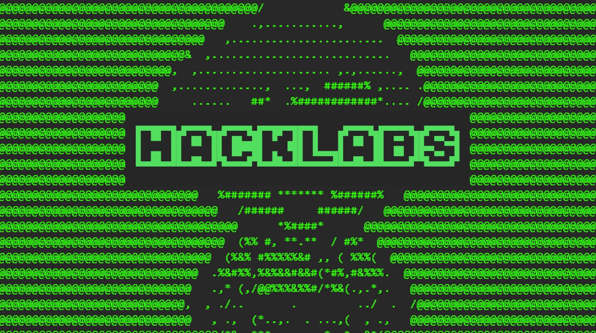

## Hello Folks, my name is Michael - codename Opacite

I am just a person who enthusiast in Cyber Security field, and try as much as I can about Cyber Security.

- Active student in Cyber Security major in one of Indonesian University,
- Actively doing Capture the Flag (CTF) to learn something new – mostly do OSINT Category,
- Currently learning some skills at [HackTheBox][HTB], [TryHackMe][THM] and [HackTheBox Academy][HackTheBoxAca].

### Other stuff I do :

[][HackLabs]
Me and the boys trying to pull some new guys to the cyber world with a fun miniCTF challenges
[Github][HackLabsGit]

[][CSC]
As one of the active member and sometimes teach on CyberClass

[HTB]: https://www.hackthebox.eu/
[THM]: https://tryhackme.com/
[HackLabs]: https://www.instagram.com/hacklabs.id/
[HackLabsGit]: https://github.com/HackLabsId/HackLabsChall/
[CSC]: https://student-activity.binus.ac.id/csc/
[HackTheBoxAca]: https://academy.hackthebox.eu/
